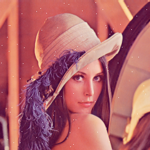
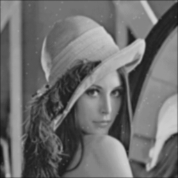
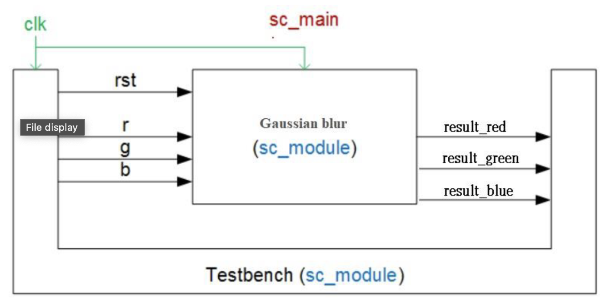
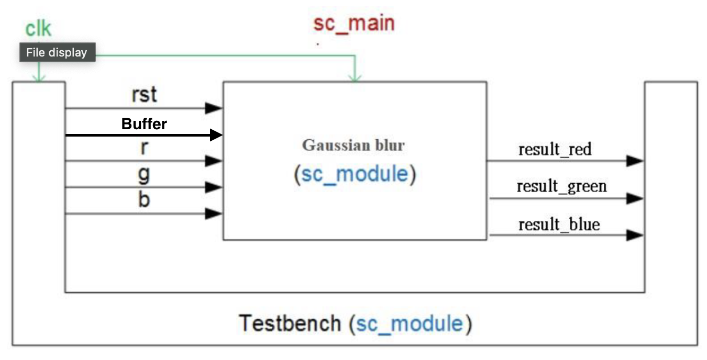
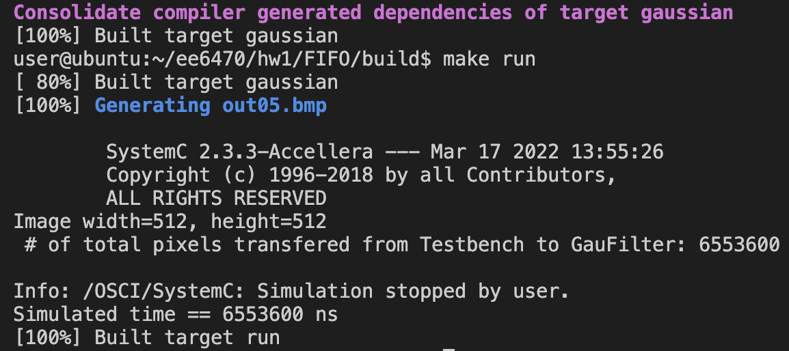
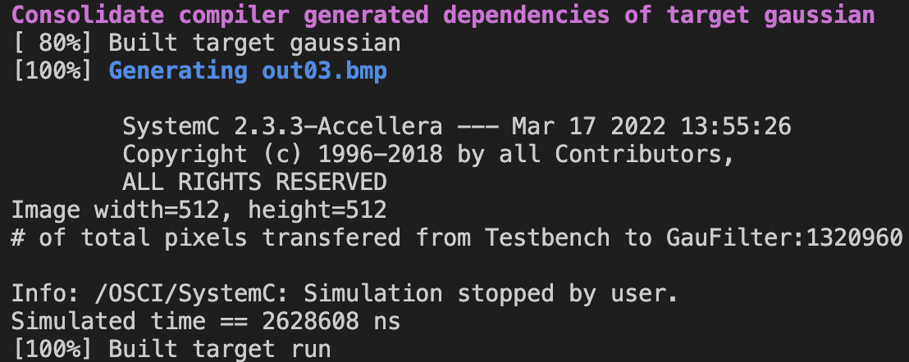

# ESL HW1

## Part1. Gaussian blur filter with FIFO channels

### How to execute the code?

1. Compile the program
   ```shell
   $ cd FIFO
   $ mkdir build
   $ cd build
   $ cmake ..
   $ make
   ```
2. Run the program
   ```shell
   make run
   ```
3. Resulting image is saved as `./build/out.bmp`

### Results

- Original image



- Filtered image



### Gaussian Filter 5 x 5 Kernel in `GaussianFilter.cpp`

```C++
// gaussian mask

const double mask[MASK_N][MASK_X][MASK_Y] =
{{
  {1.0/273, 4.0/273, 7.0/273, 4.0/273, 1.0/273},
  {4.0/273, 16.0/273, 26.0/273, 16.0/273, 4.0/273},
  {7.0/273, 26.0/273, 41.0/273, 26.0/273, 7.0/273},
  {4.0/273, 16.0/273, 26.0/273, 16.0/273, 4.0/273},
  {1.0/273, 4.0/273, 7.0/273, 4.0/273, 1.0/273}
}};

```

### Goal

Implement a Gaussian blur filter with SystemC modules connected with SystemC FIFO channels between Testbench and GaussianFilter.

### System Architecture



### Implementation

`Testbench` sends the input R, G, and B via 3 different sc_fifo channels to `GaussianFilter`. After the operation of convolution, `GaussianFilter` sends back the output result via another sc_fifo channels to Testbench. The declaration of the fifo channels are as follows.

In `GaussianFilter.h` :

```C++
sc_fifo_in<unsigned char> i_r;
sc_fifo_in<unsigned char> i_g;
sc_fifo_in<unsigned char> i_b;
sc_fifo_out<int> o_result;
```

In `Testbench.h` :

```C++
sc_fifo_out<unsigned char> o_r;
sc_fifo_out<unsigned char> o_g;
sc_fifo_out<unsigned char> o_b;
sc_fifo_in<int> i_result;
```

In `Testbench.cpp` :

Read the original RGB image.bmp, and write to r, g, b sc_fifo channels respectively.

```C++
void Testbench::do_gaussian() {
  int x, y, v, u;        // for loop counter
  unsigned char R, G, B; // color of R, G, B
  int adjustX, adjustY, xBound, yBound;
  int total;
  int total_pixels = 0;

  o_rst.write(false);
  o_rst.write(true);
  for (y = 0; y != height; ++y) {
    for (x = 0; x != width; ++x) {
      adjustX = (MASK_X % 2) ? 1 : 0; // 1
      adjustY = (MASK_Y % 2) ? 1 : 0; // 1
      xBound = MASK_X / 2;            // 1
      yBound = MASK_Y / 2;            // 1

      for (v = -yBound; v != yBound + adjustY; ++v) {   //-1, 0, 1
        for (u = -xBound; u != xBound + adjustX; ++u) { //-1, 0, 1
          if (x + u >= 0 && x + u < width && y + v >= 0 && y + v < height) {
            R = *(source_bitmap +
                  bytes_per_pixel * (width * (y + v) + (x + u)) + 2);
            G = *(source_bitmap +
                  bytes_per_pixel * (width * (y + v) + (x + u)) + 1);
            B = *(source_bitmap +
                  bytes_per_pixel * (width * (y + v) + (x + u)) + 0);
          } else {
            R = 0;
            G = 0;
            B = 0;
          }
          o_r.write(R);
          o_g.write(G);
          o_b.write(B);
          total_pixels = total_pixels + 1;
          wait(1); //emulate channel delay
        }
      }
    // ......

    }
  }

  sc_stop();
}
```

In `GaussianFilter.cpp`

Read data via r, g, b sc_fifo channels, do the convolution by 5 x 5 Gaussian bur filter, and finally write the data via o_result sc_fifo channel

```C++
void GaussianFilter::do_filter() {
  while (true) {
    for (unsigned int i = 0; i < MASK_N; ++i) {
      val[i] = 0;
    }
    for (unsigned int v = 0; v < MASK_Y; ++v) {
      for (unsigned int u = 0; u < MASK_X; ++u) {
        //0.299 R + 0.587 G + 0.114 B
        unsigned char gray = (0.299 * i_r.read() + 0.587 * i_g.read() + 0.114 * i_b.read());
        for (unsigned int i = 0; i != MASK_N; ++i) {
          val[i] += gray * mask[i][u][v];
        }
      }
    }

    double total = 0;
    for (unsigned int i = 0; i != MASK_N; ++i) {
      total += val[i] * val[i];
    }

    int result = (int)(std::sqrt(total));
    o_result.write(result);
    wait(10); //emulate module delay
  }
}
```

In `Testbench.cpp` :

Read the filtered results via i_result sc_fifo channel, and write in to \*target_bitmap as output matrix of the filtered image.

```C++
for (y = 0; y != height; ++y) {
    for (x = 0; x != width; ++x) {
      // ......


      if(i_result.num_available()==0) wait(i_result.data_written_event());
      total = i_result.read();
      //cout << "Now at " << sc_time_stamp() << endl; //print current sc_time

      *(target_bitmap + bytes_per_pixel * (width * y + x) + 2) = total;
      *(target_bitmap + bytes_per_pixel * (width * y + x) + 1) = total;
      *(target_bitmap + bytes_per_pixel * (width * y + x) + 0) = total;
    }
  }
  sc_stop();
}
```

## Part2. Gaussian blur filter with FIFO channels (with Data Buffer)

### How to execute the code?

1. Compile the program
   ```shell
   $ cd FIFO_buffer
   $ mkdir build
   $ cd build
   $ cmake ..
   $ make
   ```
2. Run the program
   ```shell
   make run
   ```
3. Resulting image is saved as `./build/out.bmp`

### Results

- Original image
- Filtered image

### Goal

Continued from `part1`, and with additional input data buffer, which can reduce the data transfer between testbench and GaussianFilter module.

- utilize 2D 5 x 5 array as the bufer size, which can at most cache 25 pixels.

### System Architecture



### Implementation

In `GaussianFilter.h` :

```C++
sc_fifo_in<unsigned char> i_r;
sc_fifo_in<unsigned char> i_g;
sc_fifo_in<unsigned char> i_b;
// input buffer control signal
sc_fifo_in<bool> i_buffer;
sc_fifo_out<int> o_result;
```

In `Testbench.h` :

```C++
sc_fifo_out<unsigned char> o_r;
sc_fifo_out<unsigned char> o_g;
sc_fifo_out<unsigned char> o_b;
sc_fifo_out<bool> o_buffer;
sc_fifo_in<int> i_result;
```

In `GaussianFilter.cpp`

Read data via r, g, b sc_fifo channels, do the convolution by 5 x 5 Gaussian bur filter, and finally write the data via o_result sc_fifo channel

```C++
void GaussianFilter::do_filter() {
  // Initializes a 5x5 buffer to store pixel values.
  unsigned char buffer[5][5] = {0};
  while (true) {
    // Initializes an array to store the filtered value (the sum of the products of the mask and the pixel values).
    for (unsigned int i = 0; i < MASK_N; ++i) {
      val[i] = 0;
    }

    // If there's new data in i_buffer
    if(i_buffer.read()) {
      // Populate the buffer with grayscale values calculated from input RGB values and apply filtering
      for (unsigned int v = 0; v < MASK_Y; ++v) {
        for (unsigned int u = 0; u < MASK_X; ++u) {
          unsigned char gray = round((i_r.read() * 0.299 + i_g.read() * 0.587 + i_b.read() * 0.114));
          buffer[v][u] = gray;
          for (unsigned int i = 0; i < MASK_N; ++i) {
            val[i] += (double)gray * mask[i][v][u];
          }
        }
      }
    }
    // Otherwise
    else {
      // shifts the buffer contents to emulate a shift register and reads a new pixel
      for (unsigned int v = 0; v < MASK_Y; ++v) {
        for (unsigned int u = 0; u < MASK_X; ++u) {
          if(u != (MASK_X - 1)) {
            buffer[v][u] = buffer[v][u + 1]; // emulate shift register (buffer shifing left)
            // Apply Gaussian mask to the shifted buffer
            for (unsigned int i = 0; i < MASK_N; ++i) {
              val[i] += (double)buffer[v][u] * mask[i][v][u];
            }
          }
          else {
            unsigned char gray = round((i_r.read() * 0.299 + i_g.read() * 0.587 + i_b.read() * 0.114));
            buffer[v][u] = gray;
            // Apply Gaussian mask to the new pixel data
            for (unsigned int i = 0; i < MASK_N; ++i) {
              val[i] += (double)gray * mask[i][v][u];
            }
          }
        }
      }
    }

    double total = 0;
    for (unsigned int i = 0; i < MASK_N; ++i) {
      total += val[i] * val[i];
    }

    //int result = (int)(std::sqrt(total));
    int result = static_cast<int>(sqrt(total));
    o_result.write(result);
    wait(10); //emulate module delay
  }
}
```

### Discussion

Compare the number of pixel transfer of between the original implementation (part1) and the one with buffers(part2)

We can notice that w/o the input buffer, the pixel data transfer is `6553600 / 1308960 = 4.96` greater.

- w/o buffer (part1):
  `6553600 pixels` transferred.

  Each pixels for calculation requires 5 x 5 data transfer. For 512 x 512 pixels input data, it requires `512 x 512 x (5 x 5) = 6553600` data transfer.

  

- w/ buffer (part2):
  `1320960 pixels` transferred.

  Calculation for first row requires 5 x 5 data transfer. AS for the remaining pixels, each pixel require 5 data transfer. For 512 x 512 pixels input data, it requires `512 cols x (5 x 5) = 12800` for first row pixels, and `512 cols x 511 rows x 5 = 1308160` for the remaining pixels. Thus, the total data transfer = `12800 + 1308160 = 1320960`

  
